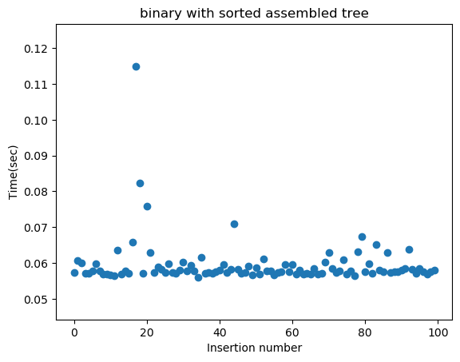

# Code
For this assignment I implemented a binary tree (binary.py) that will take a list of key/value pairs and inserted them into a tree and then return the value associated with a key upon searching. If you try to insert a second key/value pair with the same key as one already in the tree, it simply adds the value to the existing node, when searched it will return all values for a key.

Built a script to test the effiency of all the different data structures (insert_key_value_pairs.py) this script takes three arguments: the datastructure, the input file and the number of keys. It returns a scatter plot of either insertion times of search times (these are hard coded at the moment, would be good to make these into functions and arguments later). An example input is:

python insert_key_value_pairs.py --structure hash --input_file sorted.txt --num_keys 10000

I've included the bash script that runs this command as well (run_insert_key_value_pairs.sh)

(I made a few changes to avl.py in the avl_tree submodule, but didn't have permission to push them, so the script might break, I copied the file out of the submodule as avl_ryan.py. Replacing it in the script as that should make it work.)

# Experimentation 
### Goal 0:
Explore which data structure (binary tree, AVL tree, or hashtable) is best at compiling the data structure.

### Approach:
0. Compile a list of random or sorted key/value pairs (n=10,000) (see rand.sh and sorted.sh). 
1. Build data structure (see binary_tree.py, avl/avl.py, or hash_tables_shla9937/hash_table.py).
2. Attempt to insert each of 100 different keys within the range that the data structure were built from (every number ending in 01 from 1 to 10,000).
3. Time the insertion of each of these new keys and graph results.

### Results:
The binary tree seems to be slowed down as the list becomes ordered.
 

The AVL tree shows an increasing trend in insertion rates; as the value of the keys increases it takes longer to go down the tree and find the correct node to insert.
 

The hashtable with rolling hash and linear probing collison avoidance is much slower at inserting new keys than either tree. The sorted key hashtable is even slower than the random hashtable.
 

### Goal 1:
Explore which data structure (binary tree, AVL tree, or hashtable) is best at finding a value within the data structure.

### Approach:
0. Compile a list of random or sorted key/value pairs (n=10,000) (see rand.sh and sorted.sh). 
1. Build data structure (see binary_tree.py, avl/avl.py, or hash_tables_shla9937/hash_table.py).
2. Attempt to search for each of 100 different keys within the data structure.
3. Time the search of each of these new keys and graph results.

### Results:
Searching by any method seemed to be relatively fast. The slowest method was the hashtable built with sorted keys, I thought the binary tree built with sorted keys would also be slow, but it doesn't seem to be.

### Goal 2:
Explore which data structure (binary tree, AVL tree, or hashtable) is the quickest at concluding a search for a key that's not in the data structure.

### Approach:
0. Compile a list of random or sorted key/value pairs (n=10,000) (see rand.sh and sorted.sh). 
1. Build data structure (see binary_tree.py, avl/avl.py, or hash_tables_shla9937/hash_table.py).
2. Attempt to search for each of 100 different keys not in the data structure.
3. Time the search of each of these new keys and graph results.

### Results:
Both tree methods were very fast at concluding the new key wasn't in the data structure, but the hash table took quite a bit longer.
